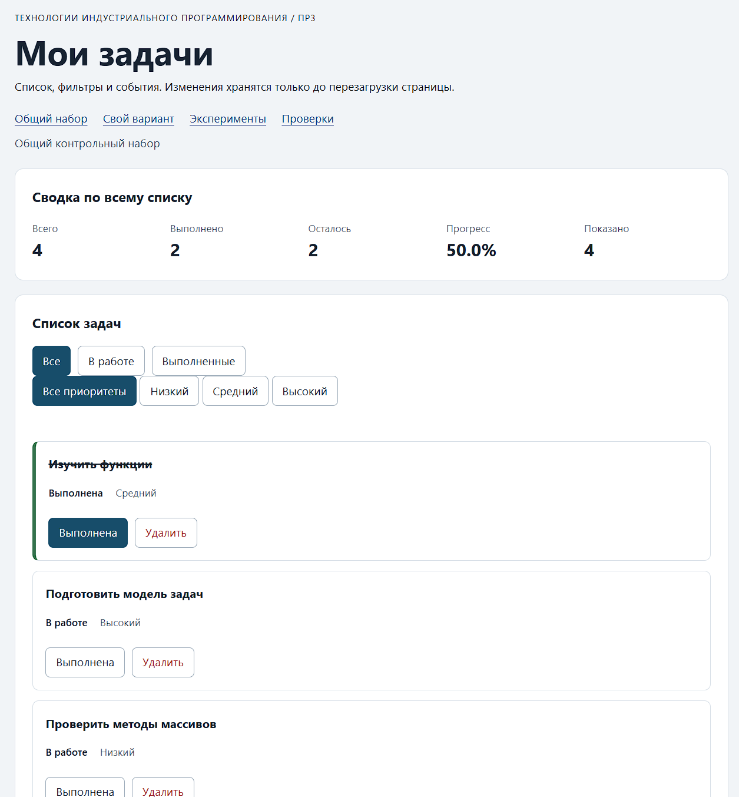

# Практическая работа № 3. Работа с DOM и событиями

## Данные работы

| Поле | Значение |
|---|---|
| Имя | Максим |
| Группа | ЭФБО-05-25 |
| Вариант из ПР2 | 4 |
| Node.js | v24.11.0 |
| Браузер | Microsoft Edge v154.0.4258.37 |
| Операционная система | Windows 11 |

## Запуск

Рабочая папка: `practice-03` внутри личного репозитория.

```bash
npm run check:service
npm start
```

Устанавливать зависимости через `npm install` не требуется. Для PowerShell при блокировке `npm.ps1` доступны `npm.cmd` и прямые команды `node`.

```text
http://127.0.0.1:5503/
http://127.0.0.1:5503/index.html?dataset=variant
http://127.0.0.1:5503/examples/dom-events.html
http://127.0.0.1:5503/checks.html
```

Остановка сервера: `Ctrl+C`. Если выбран другой порт, указать фактическую команду и адрес.

## Что перенесено из ПР2

`task-service.js` и `data.js` перенесены из ПР2 , результат повторной проверки:
Проверок пройдено: 35; не пройдено: 0.

## Эксперименты

| № | До запуска: прогноз | После запуска: результат | Объяснение |
|---:|---|---|---|
| 1. Отсутствующий элемент и коллекция | querySelector("#missing") -> null ,querySelectorAll(".nope") -> пустой NodeList | null, NodeList(0) | Разные API возвращают разные пустые значения. Проверка на null перед работой с элементом обязательна |
| 2. dataset и числовой id | dataset.taskId -> "23", после Number() -> 23 | Совпадает с прогнозом | В dataset всё хранится строками, в сервис из ПР2 передаётся число, поэтому нужна явная конвертация |
| 3. Статический NodeList | Сохранённый initialItems не вырастет, длина останется прежней, новый запрос покажет больше элементов | Совпадает с прогнозом | querySelectorAll возвращает статический снимок, для нового снимка нужен новый запрос |
| 4. Строка с HTML-разметкой | <strong>…</strong> отобразится как текст, элемент strong не создастся | Совпадает с прогнозом | textContent не интерпретирует HTML, поэтому безопасен для пользовательских названий |
| 5. Распространение события | capture (1), target (2), bubble (3), обработчик кнопки тоже сработает при клике по span | Совпадает с прогнозом | click всплывает от цели к предкам, поэтому обработчик контейнера получает нажатие на вложенный span |

## Организация кода

task-service.js - прикладные функции из ПР2 (findTaskById, getTaskStats, setTaskCompleted, removeTask и т. д.)

task-selectors.js - getVisibleTasks(tasks, filter), возвращает новый массив и не изменяет вход и DOM

task-view.js - createTaskElement, renderTaskList, renderSummary, renderEmptyState, создаёт карточки через DOM-методы, названия задаёт через textContent, список обновляет через replaceChildren

main.js - текущее состояние (currentTasks, currentFilter), распознавание действий через closest, вызовы функций из ПР2, перерисовка и восстановление фокуса

Полный список хранится в currentTasks (main.js), выбранный фильтр - в currentFilter там же, обработка кликов по списку и фильтрам - в handleTaskListClick и handleFilterClick (main.js), сводка вычисляется в renderSummary на основе getTaskStats(currentTasks), то есть всегда по полному массиву

## Общий сценарий

Ожидания находятся в разделе 6.5 методички. Ниже записываются фактические результаты запуска.

| Шаг | Видимые id | Всего | Выполнено | Осталось | Прогресс | Показано | Сообщение | Совпало с ожиданием |
|---:|---|---|---|---|---|---|---|---|
| 0 | [1, 4, 7, 10] | 4 | 2 | 2 | 50.0% | 4 | | Да |
| 1 | [4, 7] | 4 | 2 | 2 | 50.0% | 2 | | Да |
| 2 | [7] | 4 | 3 | 1 | 75.0% | 1 | | Да |
| 3 | [1, 4, 7, 10] | 4 | 3 | 1 | 75.0% | 4 | | Да |
| 4 | [1, 4, 10] | 3 | 3 | 0 | 100.0% | 3 | | Да |
| 5 | [] | 3 | 3 | 0 | 100.0% | 0 | Нет задач по выбранному фильтру. | Да |
| 6 | [1, 4, 10] | 3 | 2 | 1 | 66.7% | 3 | | Да |
| 7 | [] | 0 | 0 | 0 | 0.0% | 0 | Список задач пуст. | Да |

После перезагрузки: описать наблюдение.

## Индивидуальный вариант

Указать тему и исходные шесть задач. Приложить фактическую сводку после переключения `id = 23` и удаления `id = 37`.

| Этап | Всего | Выполнено | Осталось | Прогресс | Видимые id |
|---|---|---|---|---|---|
| До действий | 6 | 3 | 3 | 50.0% | [11, 23, 37, 41, 58, 64] |
| После переключения 23 | 6 | 2 | 4 | 33.3% | [11, 23, 37, 41, 58, 64] |
| После удаления 37 | 5 | 1 | 4 | 20.0% | [11, 23, 41, 58, 64] |
| Итог, фильтр "В работе" | 5 | 1 | 4 | 20.0% | [23, 41, 58, 64] |
| Итог, фильтр "Выполненные" | 5 | 1 | 4 | 20.0% | [11] |

## Протокол проверки сервиса

Вставить **реальный вывод** `npm run check:service`. До запуска результат не заполнен.

```text
OK: 01. Создание задачи с явным приоритетом
OK: 02. Приоритет по умолчанию
OK: 03. Удаление краевых пробелов без изменения внутренних
OK: 04. Граничные длины названия и положительный безопасный id
OK: 05. Некорректные названия при создании
OK: 06. Некорректные идентификаторы при создании
OK: 07. Все допустимые приоритеты и отклонение недопустимых
OK: 08. Каждый вызов createTask возвращает новый объект
OK: 09. Поиск по id, а не по индексу
OK: 10. Отсутствующая задача и пустой массив при поиске
OK: 11. Поиск не преобразует строковый id в число
OK: 12. Получение невыполненных задач
OK: 13. Пустой список, все выполнены и все не выполнены
OK: 14. Названия в исходном порядке и пустой список
OK: 15. Сводка по общему набору
OK: 16. Сводка по пустому списку
OK: 17. Сводка: ничего не выполнено и выполнено всё
OK: 18. Процент остаётся числом без предварительного округления
OK: 19. Добавление в конец без изменения входного массива
OK: 20. Добавление в пустой список с приоритетом по умолчанию
OK: 21. Повторяющийся id отклоняется
OK: 22. Добавление не обходит проверки createTask
OK: 23. Изменение completed в обе стороны
OK: 24. completed принимает только boolean
OK: 25. Некорректный или отсутствующий id при изменении статуса
OK: 26. Повторная установка статуса создаёт новый результат
OK: 27. Переименование сохраняет остальные поля
OK: 28. Проверки названия при переименовании
OK: 29. Некорректный или отсутствующий id при переименовании
OK: 30. Удаление по id с сохранением порядка
OK: 31. Удаление единственной записи
OK: 32. Некорректный, отсутствующий id и удаление из пустого списка
OK: 33. Входные объекты не изменяются ни одной операцией
OK: 34. Общий сценарий и все промежуточные сводки
OK: 35. Работа с другим набором, без зависимости от demoTasks

Проверок пройдено: 35; не пройдено: 0.
```

## Протокол браузерных проверок

Вставить **реальный текст** из блока "Текстовый протокол" на `checks.html`.

```text
OK: Фильтр all возвращает новый массив в исходном порядке
OK: Фильтр pending выбирает невыполненные задачи
OK: Фильтр completed выбирает выполненные задачи
OK: Все три фильтра работают с пустым списком
OK: Фильтрация не меняет входные записи и их порядок
OK: Карточка - li.task-card с числовым id в dataset
OK: Статус невыполненной карточки и aria-pressed согласованы
OK: Статус выполненной карточки и aria-pressed согласованы
OK: В карточке две обычные кнопки с вложенными подписями
OK: Все приоритеты отображаются по установленному словарю
OK: Название с разметкой отображается текстом
OK: Отрисовка списка создаёт карточки в исходном порядке
OK: Повторная отрисовка не накапливает карточки
OK: Контейнер списка и его обработчик сохраняются
OK: Отрисовка пустого массива очищает прежние карточки
OK: Сводка считается по всему списку, отдельно выводится Показано
OK: Пустая сводка не содержит NaN и Infinity
OK: Сообщение для полностью пустого списка
OK: Сообщение для пустого результата фильтра
OK: Появление карточек скрывает прежнее пустое состояние
OK: Приложение: начальный набор и сводка
OK: Приложение: фильтр срабатывает по клику на вложенный span
OK: Приложение: активный фильтр отмечен классом и aria-pressed
OK: Приложение: фильтрация не удаляет скрытые задачи
OK: Приложение: переключение по id, а не индексу массива
OK: Приложение: выполненная задача исчезает из фильтра В работе
OK: Приложение: удаление изменяет данные, а не только DOM
OK: Приложение: клик по названию не изменяет данные
OK: Приложение: после перерисовок одно нажатие - одно изменение
OK: Приложение: удаление всех записей и нулевая сводка
OK: Приложение: нет совпадений - не то же самое, что нет задач
OK: Приложение: неизвестный числовой id не меняет данные
OK: Приложение: id 4abc не превращается в 4
OK: Приложение: неизвестное действие игнорируется
OK: Приложение: после изменения сохраняется клавиатурный фокус
OK: Приложение: новая загрузка возвращает исходное состояние

Всего: 36. Пройдено: 36. Ошибок: 0.
```

## Собственные проверки

| № | Исходное состояние и действия | Ожидаемый результат | Фактический результат | Итог |
|---:|---|---|---|---|
| 1 | некорректный id , в панели Elements у одной карточки заменить data-task-id на 4abc и нажать удалить| Выводится понятное сообщение, массив не меняется, карточка остаётся | Совпадает | Пройдено |
| 2 | Повторная отрисовка, 5 раз переключить фильтры | Карточек столько же, сколько в видимой выборке, обработчики попрежнему срабатывают | Совпадает | Пройдено |
| 3 | Действие после смены фильтра , выбрать в работе, отметить задачу 4 выполненной | Задача исчезает из выборки, сводка обновляется по полному массиву, прогресс растёт | Совпадает | Пройдено |

Минимум один случай - граничное состояние, один - событие или повторная отрисовка.

## Отладка и клавиатура

Точка остановки установлена в handleTaskListClick на строке чтения card.dataset.taskId, при клике по выполнена у задачи 4 получено:
event.target - вложенный span.action-label
event.currentTarget - ul#task-list
dataset.taskId - "4" (string)
числовой id - 4 (number)
действие - toggle
результат сервиса - { ok: true, tasks: [...новый массив] }.

Для отказа было временно изменено data-task-id на 777 и 4abc через панель Elements:
777 - корректное число, но задачи нет, выводится "Задача с id=777 не найдена", массив не меняется
4abc - Number("4abc") даёт NaN, срабатывает Number.isSafeInteger, выводится "Некорректный идентификатор задачи", массив не меняется

Клавиатура: переход по Tab до кнопки фильтра и кнопок карточки работает, активация Enter и Space срабатывает так же, как клик, после переключения статуса фокус возвращается на ту же кнопку задачи через restoreTaskFocus, после удаления - на кнопку активного фильтра, отказ 4abc и 777 не приводит к потере фокуса страницы

## Вид приложения



## Дополнительное задание

Расширение А:

Правила поведения:

1. В интерфейсе появилась отдельная группа кнопок `#priority-filters` со значениями
   `all`, `low`, `medium`, `high` (подписи: "Все приоритеты", "Низкий", "Средний", "Высокий")
2. Фильтр по статусу и фильтр по приоритету применяются совместно: сначала по статусу
   (`getVisibleTasks`), затем по приоритету (`filter`), порядок задач сохраняется
3. Общая сводка по-прежнему считается по полному `currentTasks` через `getTaskStats`, 
    "Показано" равно длине совместной выборки
4. Контракт обязательной части не изменён: три кнопки статуса остаются в `#task-filters`,
   сигнатура `getVisibleTasks(tasks, filter = "all")` сохранена, добавлена отдельная
   чистая функция `getVisibleTasksByPriority(tasks, filter, priority)`
5. Корректный выбор любого фильтра (статус или приоритет) очищает сообщение об операции
6. Состояние двух фильтров хранится независимо: `currentFilter` и `currentPriority`,
   изменение одного не сбрасывает другой.

Проверки:

| № | Исходное состояние и действия | Ожидание | Фактический результат | Итог |
|---:|---|---|---|---|
| 1. Совместный отбор | Оба фильтра "Все", выбрать "В работе" + "Высокий" | Показаны только невыполненные задачи высокого приоритета, сводка по полному массиву, "Показано" равно длине выборки | Совпадает | Пройдено |
| 2. Действие внутри активного фильтра | Активны "В работе" + "Высокий", отметить единственную видимую задачу выполненной | Задача исчезает из выборки, прогресс в сводке растёт, появляется "Нет задач по выбранному фильтру", если совпадений больше нет | Совпадает | Пройдено |
| 3. Граница: пустая совместная выборка | Выбрать "Выполненные" + "Низкий" (при отсутствии таких задач у набора) | Сообщение "Нет задач по выбранному фильтру", `hidden = false`, сводка по полному массиву без `NaN` и `Infinity`, "Показано: 0" | Совпадает | Пройдено |

Реализация:

- `task-selectors.js`: добавлена чистая функция `getVisibleTasksByPriority`;
  контракт `getVisibleTasks` не изменён, проверки `checks.html` продолжают
  проходить 36 из 36
- `main.js`: добавлено состояние `currentPriority`, обработчик `handlePriorityClick`,
  функция отметки активной кнопки `updatePriorityButtons` и подписка на контейнер
  `#priority-filters` (одна, вне `renderApp`)
- `index.html`: добавлена отдельная группа кнопок `#priority-filters` с атрибутами
  `data-priority` - их не захватывает селектор `button[data-filter]` основных фильтров
- `task-view.js`, `task-service.js`, `data.js` не изменялись

## Вывод

В ходе работы данные и функции ПР2 были связаны с браузерным интерфейсо, cписок задач отрисовывается через DOM-методы, названия выводятся как текст, действия обрабатываются делегированно на контейнере ul, а фильтры меняют только видимую выборку, не затрагивая полный массив, cводка считается по currentTasks, "Показано" - по выборке. Все 35 сервисных и 36 браузерных проверок пройдены

Ключевое различие: изменение данных (через setTaskCompleted и removeTask) и изменение DOM (карточки) - разные операции, удаление li через element.remove() само по себе не удаляет задачу, а простое изменение currentTasks без renderApp() не обновляет страницу, правильный порядок - сначала операция над массивом через сервис ПР2, затем перерисовка
