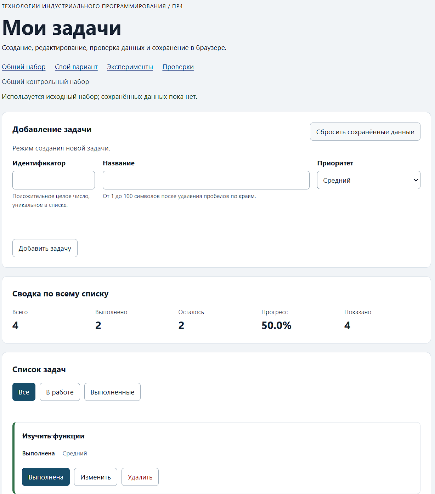

# Практическая работа № 4. Формы, валидация и локальное хранение данных

## Данные работы

| Поле | Значение |
|---|---|
| Имя | Максим |
| Группа | ЭФБО-05-25 |
| Вариант из ПР2–ПР3 | 4 |
| Node.js | v24.11.0 |
| Браузер | Microsoft Edge v154.0.4258.37 |
| Операционная система | Windows 11 |

## Запуск

Рабочая папка: `practice-04` внутри личного репозитория.

```bash
npm test
npm start
```

Устанавливать зависимости через `npm install` не требуется.

```text
http://127.0.0.1:5504/
http://127.0.0.1:5504/index.html?dataset=variant
http://127.0.0.1:5504/examples/forms-storage.html
http://127.0.0.1:5504/checks.html
```

Если использован другой порт, указать фактическую команду и адрес.

## Перенос результата ПР3

Указать, какие модули перенесены из ПР3, какие исправления потребовались и какой результат показали повторные проверки сервиса.

| Файл | Что перенесено или изменено |
|---|---|
| `data.js` | Общий набор и шесть задач 4 варианта  |
| `task-service.js` | Все функции ПР2 и ПР3, добавлена updateTask, меняющая только title и priority и сохраняющая completed и исходный массив |
| `task-selectors.js` | getVisibleTasks и getVisibleTasksByPriority |
| `task-view.js` | Отрисовка ПР3, В карточку добавлена третья кнопка edit с data-action="edit" и вложенным span.action-label с текстом "изменить", название по-прежнему выводится через textContent |

## Эксперименты с формой и хранилищем

| № | До запуска: прогноз | После запуска: результат | Объяснение |
|---:|---|---|---|
| 1. Пустое обязательное поле | Браузер не пропустит отправку, прикладной обработчик не вызовется | Журнал не изменился, появилось стандартное сообщение браузера | Нативная проверка блокирует отправку до вызова прикладного обработчика, поэтому код чтения формы не выполняется |
| 2. Название из пробелов | Нативная проверка пропустит, прикладная отклонит | Обработчик сработал, показана прикладная ошибка, запись не выполнена | `required` считает строку из пробелов непустой, прикладное правило удаляет краевые пробелы и отклоняет пустой результат |
| 3. Типы значений `FormData` | Действие отменено, в хранилище попадает строка | Значения строковые, сохранённое значение - строка, показан восстановленный объект | `FormData` всегда возвращает строки, а хранилище хранит только строки, поэтому объект перед записью сериализуется |
| 4. Строка в `localStorage` и JSON | Чтение вернёт строку, разбор - объект, до сохранения чтение вернёт отсутствие значения | После сохранения - строка и объект, до сохранения - сообщение об отсутствии записи | Хранилище оперирует строками, отсутствие ключа отличается от пустой строки - это различие используется при загрузке |
| 5. Повреждённый JSON | Разбор завершится ошибкой | Записана повреждённая строка, чтение вывело сообщение об ошибке, страница продолжила работу | Разбор выполняется внутри перехвата исключения, поэтому ошибка не выходит наружу, такое же поведение у модуля хранения приложения |

## Организация кода

| Модуль | Ответственность |
|---|---|
| `task-service.js` | Чистые операции над массивом задач, не знает про DOM, форму и хранилище |
| `form-validation.js` | Проверка черновика формы: нормализация строк, уникальность id, длина названия, допустимый приоритет |
| `task-storage.js` | Сериализация, разбор JSON, проверка версии и схемы задач, перехват исключений хранилища |
| `task-view.js` | Создание карточек, списка, сводки и пустого состояния, обработчики не назначаются |
| `main.js` | Текущее состояние, режим формы, события, координация сервиса, хранения и отрисовки |

Хранилище передаётся в функции аргументом - это упрощает проверку и явно
показывает внешнюю зависимость, данные из JSON проверяются целиком, потому что
успешный разбор подтверждает только синтаксис, но не корректность модели

## Проверка формы

| Сценарий | Ожидаемый результат | Фактический результат | Итог |
|---|---|---|---|
| Добавление корректной задачи | Задача появляется в конце списка, записывается в хранилище | Задача добавлена, сводка обновилась, запись выполнена | Пройдено |
| Повторяющийся id | Отказ без изменения списка и без записи | Ошибка у поля id, список не изменился, записи нет | Пройдено |
| Пустое название | Отказ нативной проверки | Стандартное сообщение браузера, список не изменился | Пройдено |
| Название из пробелов | Отказ прикладной проверки | Ошибка у поля названия, записи нет | Пройдено |
| Название длиной 100 | Успех | Задача добавлена | Пройдено |
| Название длиной 101 | Отказ | Превышение максимальной длины не допускается | Пройдено |
| Редактирование названия и приоритета | Меняется одна задача, статус сохраняется | Название и приоритет обновлены, статус без изменений | Пройдено |
| Отмена редактирования | Возврат к пустой форме создания | Поля пусты, идентификатор снова доступен, кнопка добавить задачу | Пройдено |

## Общий сценарий

Записать фактические результаты последовательности из раздела 6.8 методички.

| Шаг | Действие | Видимые id | Всего | Выполнено | Осталось | Прогресс | Состояние storage |
|---:|---|---|---:|---:|---:|---:|---|
| 0 | Исходный запуск после сброса | [1,4,7,10] | 4 | 2 | 2 | 50.0% | Ключа нет |
| 1 | Добавление `id = 20` | [1,4,7,10,20] | 5 | 2 | 3 | 40.0% | Запись создана |
| 2 | Отказ для повторного `id = 4` | [1,4,7,10,20] | 5 | 2 | 3 | 40.0% | Без изменений |
| 3 | Редактирование `id = 4` | [1,4,7,10,20] | 5 | 2 | 3 | 40.0% | Обновлено |
| 4 | Переключение `id = 7` | [1,4,7,10,20] | 5 | 3 | 2 | 60.0% | Обновлено |
| 5 | Удаление `id = 1` | [4,7,10,20] | 4 | 2 | 2 | 50.0% | Обновлено |
| 6 | Перезагрузка страницы | [4,7,10,20] | 4 | 2 | 2 | 50.0% | Данные восстановлены |
| 7 | Сброс данных | [1,4,7,10] | 4 | 2 | 2 | 50.0% | Ключ удалён |

## Проверка восстановления и ошибок

| Случай | Ожидание | Фактический результат | Итог |
|---|---|---|---|
| Записи нет | Используется независимая копия исходного набора | Показан исходный набор, изменений нет | Пройдено |
| Корректная запись | Данные восстанавливаются после перезагрузки | Список и сводка совпадают с состоянием до перезагрузки | Пройдено |
| Повреждённый JSON | Приложение запускается с исходным набором и предупреждением | Запуск успешен, показан исходный набор и предупреждение | Пройдено |
| Неверная версия или схема | Исходный набор и предупреждение | Использован исходный набор, выведено предупреждение | Пройдено |
| Сброс | Удаляется только ключ текущего набора | Ключ текущего набора отсутствует, остальные ключи не тронуты | Пройдено |
| Общий и индивидуальный наборы | Изменения не смешиваются | Разные ключи, взаимного влияния нет | Пройдено |

## Индивидуальный вариант

Исходные задачи:
| id | Название | completed | priority |
|---:|---|---|---|
| 11 | Составить план семинара | true | high |
| 23 | Подготовить материалы | true | medium |
| 37 | Согласовать аудитории | true | low |
| 41 | Собрать вопросы участников | false | medium |
| 58 | Проверить оборудование | false | high |
| 64 | Разослать напоминание | false | low |

| Этап | Всего | Выполнено | Осталось | Прогресс | Видимые id |
|---|---:|---:|---:|---:|---|
| Исходный набор | 6 | 3 | 3 | 50.0% | 11, 23, 37, 41, 58, 64 |
| После добавления `75` | 7 | 3 | 4 | 42.9% | 11, 23, 37, 41, 58, 64, 75 |
| После редактирования `23` | 7 | 3 | 4 | 42.9% | 11, 23, 37, 41, 58, 64, 75 |
| После удаления `37` | 6 | 2 | 4 | 33.3% | 11, 23, 41, 58, 64, 75 |
| После перезагрузки | 6 | 2 | 4 | 33.3% | 11, 23, 41, 58, 64, 75 |
| После сброса | 6 | 3 | 3 | 50.0% | 11, 23, 37, 41, 58, 64 |

## Протокол проверок сервиса

Вставить реальный вывод `npm run check:service`.

```text
OK: 01. Создание задачи с явным приоритетом
OK: 02. Приоритет по умолчанию
OK: 03. Удаление краевых пробелов без изменения внутренних
OK: 04. Граничные длины названия и положительный безопасный id
OK: 05. Некорректные названия при создании
OK: 06. Некорректные идентификаторы при создании
OK: 07. Все допустимые приоритеты и отклонение недопустимых
OK: 08. Каждый вызов createTask возвращает новый объект
OK: 09. Поиск по id, а не по индексу
OK: 10. Отсутствующая задача и пустой массив при поиске
OK: 11. Поиск не преобразует строковый id в число
OK: 12. Получение невыполненных задач
OK: 13. Пустой список, все выполнены и все не выполнены
OK: 14. Названия в исходном порядке и пустой список
OK: 15. Сводка по общему набору
OK: 16. Сводка по пустому списку
OK: 17. Сводка: ничего не выполнено и выполнено всё
OK: 18. Процент остаётся числом без предварительного округления
OK: 19. Добавление в конец без изменения входного массива
OK: 20. Добавление в пустой список с приоритетом по умолчанию
OK: 21. Повторяющийся id отклоняется
OK: 22. Добавление не обходит проверки createTask
OK: 23. Изменение completed в обе стороны
OK: 24. completed принимает только boolean
OK: 25. Некорректный или отсутствующий id при изменении статуса
OK: 26. Повторная установка статуса создаёт новый результат
OK: 27. Переименование сохраняет остальные поля
OK: 28. Проверки названия при переименовании
OK: 29. Некорректный или отсутствующий id при переименовании
OK: 30. Удаление по id с сохранением порядка
OK: 31. Удаление единственной записи
OK: 32. Некорректный, отсутствующий id и удаление из пустого списка
OK: 33. Входные объекты не изменяются ни одной операцией
OK: 34. Общий сценарий и все промежуточные сводки
OK: 35. Работа с другим набором, без зависимости от demoTasks

Проверок пройдено: 35; не пройдено: 0.
```

## Протокол проверок новых модулей

Вставить реальный вывод `npm run check:modules`.

```text
OK: 01. updateTask изменяет название и приоритет выбранной задачи
OK: 02. updateTask нормализует название и сохраняет completed
OK: 03. updateTask не изменяет входной массив и объекты
OK: 04. updateTask отклоняет некорректный и отсутствующий id
OK: 05. updateTask отклоняет некорректные название и приоритет
OK: 06. Валидация создания нормализует поля
OK: 07. Валидация отклоняет некорректные id
OK: 08. Валидация отклоняет повторяющийся id при создании
OK: 09. Валидация проверяет название после trim
OK: 10. Валидация принимает только три приоритета
OK: 11. В режиме редактирования используется editingId
OK: 12. Редактирование отсутствующей задачи отклоняется
OK: 13. Валидация не изменяет draft и список
OK: 14. Проверка схемы принимает корректный список
OK: 15. Проверка схемы отклоняет неверную структуру
OK: 16. Отсутствующая запись возвращает независимую копию исходных данных
OK: 17. Корректная запись восстанавливается из хранилища
OK: 18. Повреждённый JSON приводит к безопасному fallback
OK: 19. Неизвестная версия приводит к безопасному fallback
OK: 20. Некорректные задачи из JSON не принимаются
OK: 21. Ошибка getItem перехватывается
OK: 22. Сохранение записывает версию и задачи
OK: 23. Некорректный список не записывается
OK: 24. Ошибка setItem перехватывается
OK: 25. Удаляется только переданный ключ
OK: 26. Ошибка removeItem перехватывается
OK: 27. Результат загрузки не разделяет объекты с fallback

Проверок пройдено: 27; не пройдено: 0.
```

## Протокол браузерных проверок

Вставить реальный текст из блока Текстовый протокол» на `checks.html`.

```text
OK: Фильтры ПР3 сохраняют порядок и не изменяют вход
OK: Карточка содержит toggle, edit и delete
OK: Название задачи выводится как текст
OK: Повторная отрисовка списка не накапливает карточки
OK: Сводка использует полный список и отдельный visibleCount
OK: Пустые состояния различают список и фильтр
OK: Приложение запускается с исходным набором
OK: Корректная форма добавляет задачу и сохраняет данные
OK: Повторяющийся id отклоняется без записи
OK: Название из пробелов отклоняется прикладной проверкой
OK: Нативные ограничения не пропускают пустую форму
OK: Кнопка edit заполняет форму и блокирует id
OK: Редактирование меняет title и priority, сохраняя completed
OK: Отмена редактирования возвращает режим создания
OK: Успешная отправка очищает ошибки и форму
OK: Изменение статуса сохраняется
OK: Удаление сохраняется
OK: Фильтр не записывается, но сохраняется после изменения данных
OK: Перезагрузка восстанавливает сохранённые задачи
OK: Сброс удаляет ключ и восстанавливает исходный набор
OK: Повреждённый JSON не ломает запуск
OK: Некорректная схема из storage заменяется исходным набором
OK: Общий и индивидуальный наборы используют разные ключи
Всего: 23. Пройдено: 23. Ошибок: 0.
```

## Собственные проверки

| № | Исходное состояние и действия | Ожидаемый результат | Фактический результат | Итог |
|---:|---|---|---|---|
| 1 | Форма создания, идентификатор пуст, название заполнено, приоритет `low` | Отказ прикладной проверки с сообщением о необходимости идентификатора | Появилось сообщение у поля идентификатора, запись не выполнена | Пройдено |
| 2 | Добавить задачу, перезагрузить страницу, затем удалить её и перезагрузить снова | После первой перезагрузки задача есть, после второй - нет | Состояние восстановилось корректно в обоих случаях | Пройдено |
| 3 | Записать в ключ общего набора JSON с неподдерживаемой версией схемы и перезагрузить | Приложение запускается с исходным набором и предупреждением | Показан исходный набор, выведено предупреждение о версии | Пройдено |

## Отладка и клавиатура

Точка останова установлена в обработчике отправки формы, на успешном
сценарии добавления задачи зафиксированы:

- сырой черновик - идентификатор приходит строкой, название содержит
  краевые пробелы, приоритет - строка из формы
- результат прикладной проверки - идентификатор нормализован в число,
  название очищено от пробелов, ошибок нет
- результат сервисной операции - исходный массив не изменён, добавлена
  новая задача в конце, поле `completed` установлено в `false`
- записанная строка JSON - объект с версией схемы и полным списком задач

На ошибочном сценарии с повторяющимся идентификатором прикладная проверка
вернула ошибку по полю идентификатора, в хранилище ничего не записано,
список и сводка остались прежними

Клавиатурное управление: Tab последовательно обходит поля формы и кнопки
действий, Enter в любом поле отправляет форму, Space активирует кнопки
карточек, при переходе в режим редактирования фокус перемещается в поле
названия, при отмене - в поле идентификатора

## Вид приложения



## Дополнительное задание

Не выполнено

## Вывод

В ходе работы к приложению ПР3 добавлены форма создания и редактирования,
двухуровневая проверка ввода и сохранение состояния в `localStorage`

- Нативная проверка HTML отвечает за структуру полей и стандартное
  клавиатурное поведение, но не знает про `trim`, уникальность идентификатора
  и допустимые приоритеты
- Прикладная проверка - чистая функция, которая нормализует строковые
  значения формы и возвращает либо готовые данные для операции, либо набор
  ошибок по полям, она не работает с DOM и не показывает сообщения
- Проверка после чтения из хранилища защищает от повреждённого JSON,
  устаревшей версии схемы и частично некорректных записей, успешный разбор
  подтверждает только синтаксис, поэтому набор проверяется целиком и либо
  принимается, либо полностью заменяется исходным

Разделение ответственности между сервисом, валидацией, хранилищем,
отрисовкой и координатором позволило повторно использовать логику ПР2 и ПР3
без дублирования, отрисовка не пишет в хранилище, операции сервиса не
изменяют входной массив, а ошибки хранилища не прерывают работу приложения
